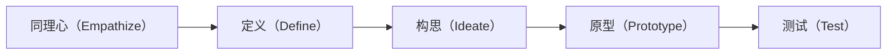

# Stanford_Design_Thinking 斯坦福设计思维

> 斯坦福设计思维是一种以人为本的创新方法论，它通过深入理解用户需求，结合创造性思维和实践验证，来解决复杂的设计问题。这种方法由斯坦福大学设计学院（d.school）开发和推广，已被广泛应用于产品设计、服务创新和组织变革等领域。

## 核心原则

### 1. 以人为本
- **用户中心**
  - 深入理解用户
  - 同理心观察
  - 需求发现
  - 价值创造
- **多元视角**
  - 跨学科合作
  - 多方参与
  - 开放思维
  - 包容创新

### 2. 迭代优化
- **快速验证**
  - 原型制作
  - 用户测试
  - 反馈收集
  - 持续改进
- **失败学习**
  - 接纳失败
  - 经验总结
  - 方案优化
  - 持续成长

### 3. 实践导向
- **动手实践**
  - 具体行动
  - 实地验证
  - 经验积累
  - 能力提升
- **团队协作**
  - 集体智慧
  - 资源整合
  - 共同创造
  - 成果共享

## 五个阶段

### 1. 同理心（Empathize）
- **用户理解**
  - 观察行为
  - 倾听需求
  - 感受情感
  - 理解动机
- **研究方法**
  - 实地观察
  - 深度访谈
  - 用户日志
  - 角色扮演

### 2. 定义（Define）
- **问题聚焦**
  - 信息整理
  - 洞察提炼
  - 问题定义
  - 机会识别
- **工具方法**
  - 亲和图
  - 用户旅程
  - 洞察陈述
  - 机会地图

### 3. 构思（Ideate）
- **创意发散**
  - 头脑风暴
  - 联想扩展
  - 可能性探索
  - 方案生成
- **创意工具**
  - 思维导图
  - 创意矩阵
  - 类比迁移
  - 反向思考

### 4. 原型（Prototype）
- **快速原型**
  - 低保真原型
  - 纸面原型
  - 功能原型
  - 体验原型
- **制作方法**
  - 草图绘制
  - 模型制作
  - 场景模拟
  - 交互演示

### 5. 测试（Test）
- **验证评估**
  - 用户测试
  - 反馈收集
  - 问题发现
  - 方案优化
- **测试方法**
  - 可用性测试
  - A/B测试
  - 用户访谈
  - 行为观察

## 工具和方法

### 1. 研究工具
- **观察工具**
  - 观察记录表
  - 行为追踪
  - 照片日志
  - 视频记录
- **访谈工具**
  - 访谈提纲
  - 录音设备
  - 记录模板
  - 分析框架

### 2. 分析工具
- **数据整理**
  - 亲和图法
  - 分类矩阵
  - 关系图
  - 系统图
- **洞察提炼**
  - 洞察框架
  - 机会地图
  - 价值主张
  - 设计原则

### 3. 创意工具
- **发散思维**
  - 头脑风暴
  - 创意卡片
  - 灵感触发
  - 随机联想
- **收敛工具**
  - 评估矩阵
  - 决策树
  - 投票法
  - 优先级排序

### 4. 原型工具
- **表现工具**
  - 草图工具
  - 建模软件
  - 原型工具
  - 演示工具
- **测试工具**
  - 测试计划
  - 反馈表格
  - 评估量表
  - 分析模板

## 实践建议

1. **团队组建**
   - 跨学科组合
   - 角色互补
   - 能力互补
   - 共同愿景

2. **流程管理**
   - 时间规划
   - 资源配置
   - 进度控制
   - 质量把控

3. **文化建设**
   - 开放包容
   - 勇于尝试
   - 快速迭代
   - 持续学习

4. **成果应用**
   - 落地实施
   - 效果评估
   - 经验总结
   - 持续优化 