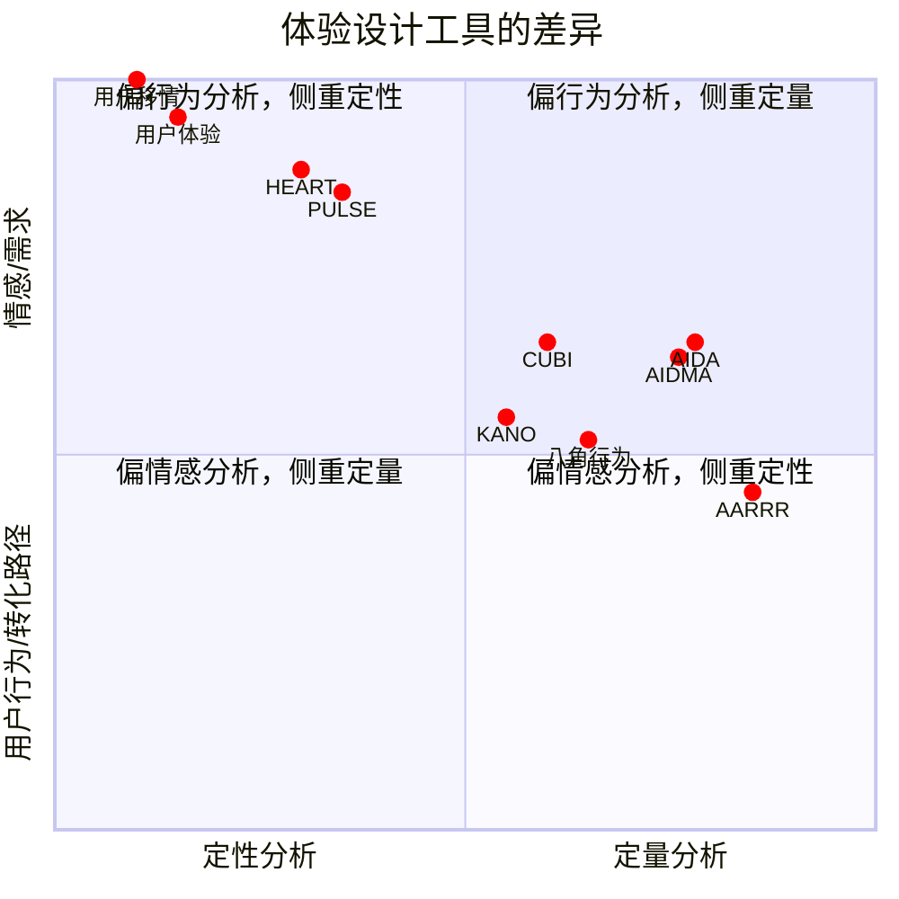

# 体验设计工具分析与应用指南

这些体验设计工具是UI/UX设计师的重要资产，每个工具都有其独特的应用场景和价值。本指南将帮助设计师理解如何在设计流程中有效运用这些工具。

## 用户研究方法
### 1、定性研究方法
- 深度访谈（In-depth Interview）
- 焦点小组（Focus Group）
- 实地观察（Field Observation）
- 用户日志（User Diary）
- 可用性测试（Usability Testing）

### 2、定量研究方法
- 问卷调查（Questionnaire）
- A/B测试（A/B Testing）
- 数据分析（Data Analytics）
- 眼动追踪（Eye Tracking）
- 热力图分析（Heat Map Analysis）

## 认知型体验理论
### 1、认知负荷理论
- 工作记忆容量限制
- 信息加工过程
- 认知资源分配

### 2、格式塔原理
- 相似性原则
- 连续性原则
- 闭合性原则
- 近似性原则

## 相同之处

### 1、以用户为中心的设计思维
所有工具都强调以用户为核心，通过深入理解用户需求、行为模式和情感反应来指导设计决策。例如：
- 用户研究阶段：通过观察和访谈收集用户反馈
- 设计阶段：将用户需求转化为具体的设计方案
- 评估阶段：验证设计是否满足用户期望

### 2、关注用户的生命周期
工具中的许多模型，如 [[AARRR 模型]]、[[AIDA 模型]]、[[HEART 模型]]、[[GSM 模型]]等，都强调用户在使用产品过程中的不同阶段。这些阶段通常包括获取、激活、留存、购买等，目的是分析和优化产品在不同生命周期中的用户体验。

### 3、强调行为驱动
大部分工具都注重用户的行为分析，尤其是 [[AARRR 模型]]、[[AIDMA 模型]]、[[八角行为分析]]等。这些工具试图通过识别用户的行为模式、动机和决策过程，来提高用户参与度、忠诚度和转化率。

### 4、优化用户体验
所有这些工具的最终目标都是提升用户体验。无论是通过 [[KANO 模型]]对用户需求的细分、通过 [[PULSE 模型]]和 [[HEART 模型]]关注用户情感和满意度，还是通过[[用户移情图]]和[[用户体验地图]]对用户的痛点进行识别，它们都在帮助团队发现问题并改进产品。

## 差异之处

### 1、设计阶段应用重点
- 前期研究：[[用户移情图]]、[[KANO 模型]] - 适用于需求收集和用户洞察
- 设计过程：[[CUBI 模型]]、[[八角行为分析]] - 指导具体的交互设计决策
- 产品优化：[[HEART 模型]]、[[PULSE 模型]] - 评估和改进现有设计

### 2、数据应用方式
- 定量工具（如HEART、AARRR）：
  * 适用场景：A/B测试、用户行为跟踪
  * 关键指标：转化率、留存率、任务完成时间
- 定性工具（如用户移情图、KANO）：
  * 适用场景：用户访谈、观察研究
  * 关键产出：用户洞察、行为模式、情感需求

###  3、分析的维度不同

- [[KANO 模型]]专注于用户需求的不同类型，如基本需求、性能需求、激励需求等，帮助团队识别哪些功能会增加用户满意度，哪些功能会导致不满。
- [[八角行为分析]]关注的是用户参与过程中的八个核心驱动力，从情感和行为的角度分析用户的动机。
- AARRR、AIDA、[[AIDMA 模型]]侧重于用户的行为路径，着重分析用户从意识到购买、甚至推荐的整个转化过程。
- GSM、PULSE、[[HEART 模型]]则更多关注用户的情感、满意度和产品性能对用户的影响，适用于评估和优化用户体验的具体结果。

### 4、理论应用的重点不同

- AIDA、AIDMA、AARRR模型较为偏向市场营销和用户转化路径的分析，它们特别适用于提升营销效果、用户增长和商业转化。
- [[KANO 模型]]适用于需求分析，帮助团队识别哪些功能会影响用户的满意度和忠诚度，侧重于产品特性设计。
- [[PULSE 模型]]关注的是用户的长期忠诚度，尤其是如何从情感层面提升用户满意度和参与度。
- [[HEART 模型]]更侧重于通过五个维度（幸福感、参与度、使用率、任务成功率和保留率）来量化和优化用户体验。
- [[CUBI 模型]]强调通过便利性、可用性、行为和交互四个维度分析用户体验，帮助优化产品设计。
- [[用户移情图]]和[[用户体验地图]]则更关注情感层面，通过对用户言语、想法、行为、痛点和收获的深入分析，帮助设计师更好地理解用户，尤其在用户研究和设计初期阶段非常重要。

### 5、用户参与的角度

- [[用户移情图]]和[[用户体验地图]]更加侧重于通过与用户的深度互动、访谈和观察来理解用户的真实需求和情感。
- 其他模型（如 AARRR、AIDA、HEART）则侧重于通过量化的方式从行为和结果上分析用户参与的程度、转化率和忠诚度。

## 设计实践建议

### 工具选择指南
1. 项目初期：使用[[用户移情图]]和[[KANO 模型]]深入理解用户需求
2. 设计阶段：结合[[CUBI 模型]]和[[八角行为分析]]优化交互设计
3. 评估阶段：使用[[HEART 模型]]和[[PULSE 模型]]量化用户体验

## 总结

- **相似性**：这些工具共同的目标是提升用户体验，都注重用户需求和行为分析，帮助团队通过优化产品或服务来提高用户满意度和粘性。
- **差异性**：它们的差异主要体现在分析的重点和应用的场景上。有些工具关注用户的行为路径和营销转化（如 AARRR、AIDA、AIDMA），有些则偏向情感和满意度分析（如 PULSE、HEART、KANO），还有一些则通过深度的用户研究（如[[用户移情图]]、[[用户体验地图]]）来识别痛点和机会。

综合来看，这些工具可以互补使用，帮助团队从多个角度全面理解和优化用户体验，提升产品的市场表现和用户满意度。

